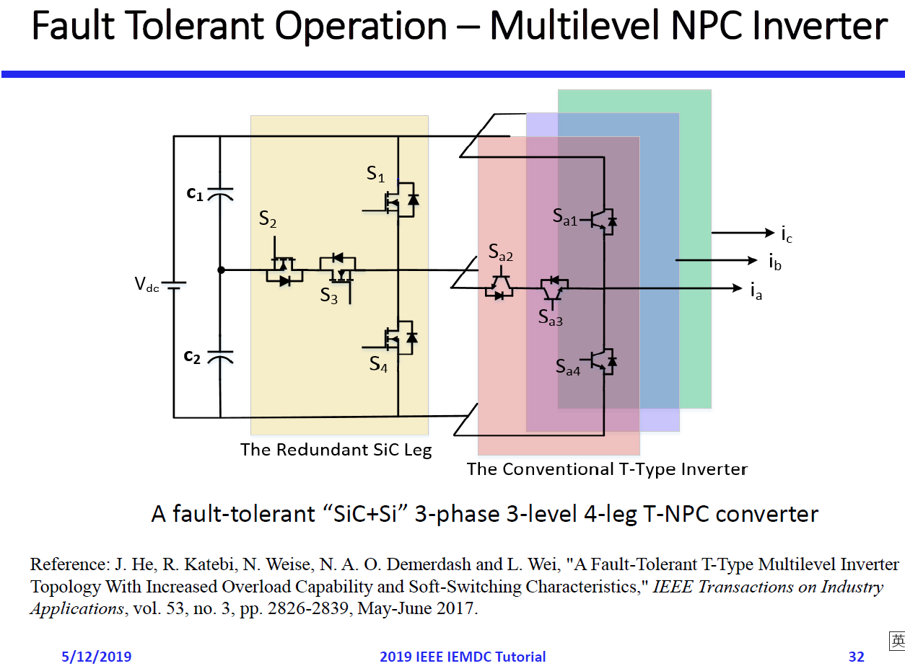
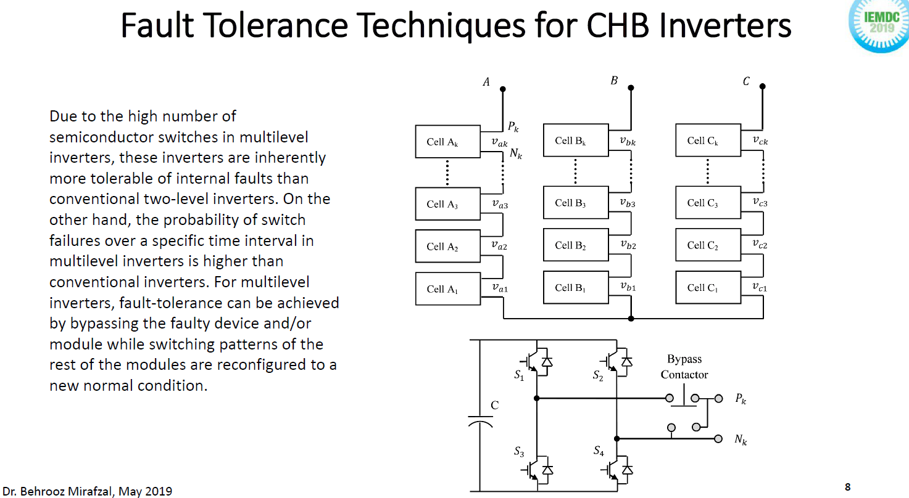
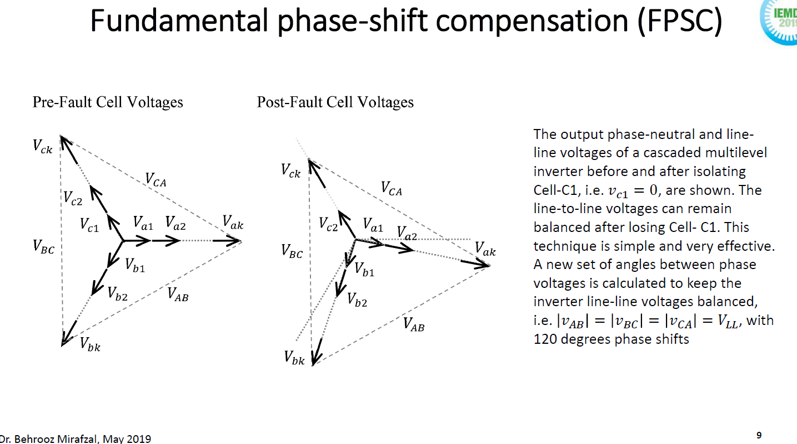
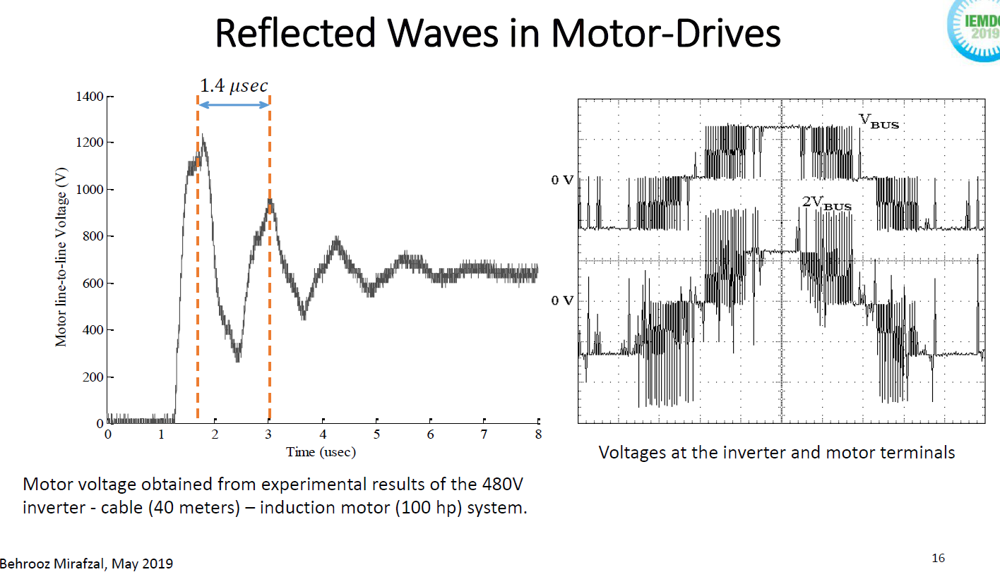
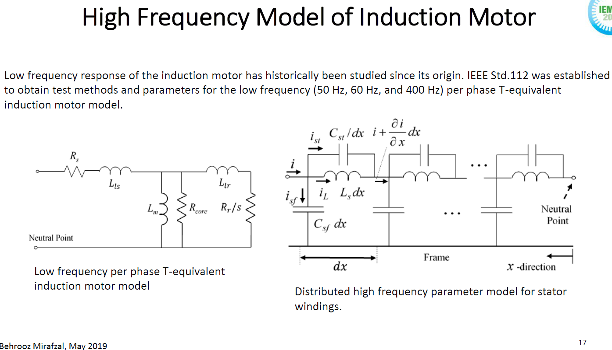
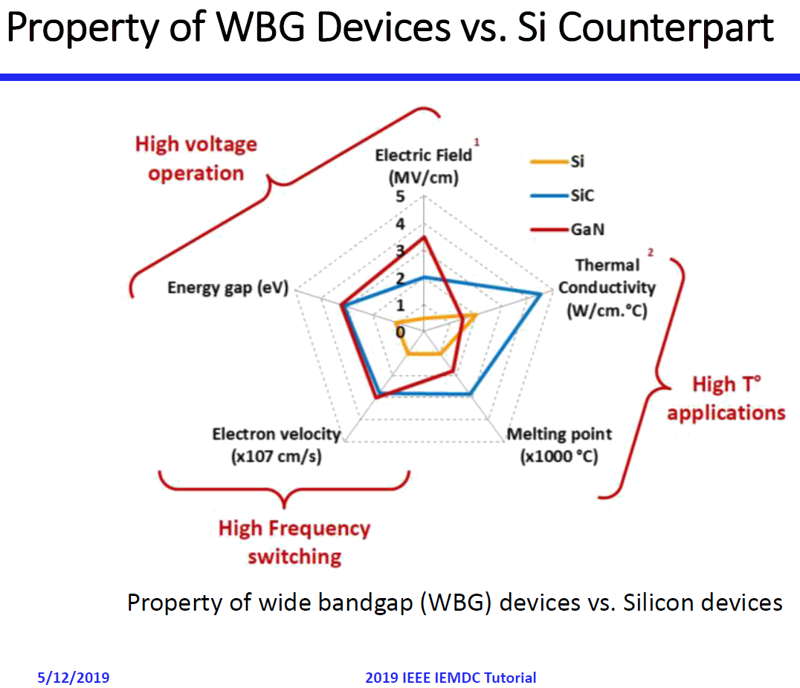
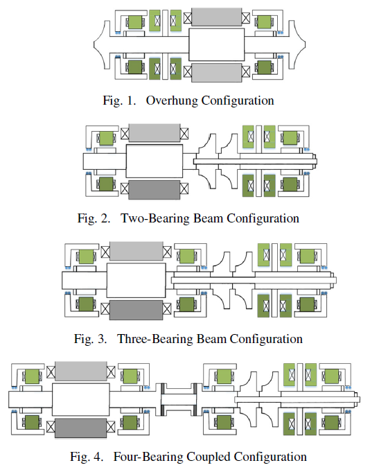
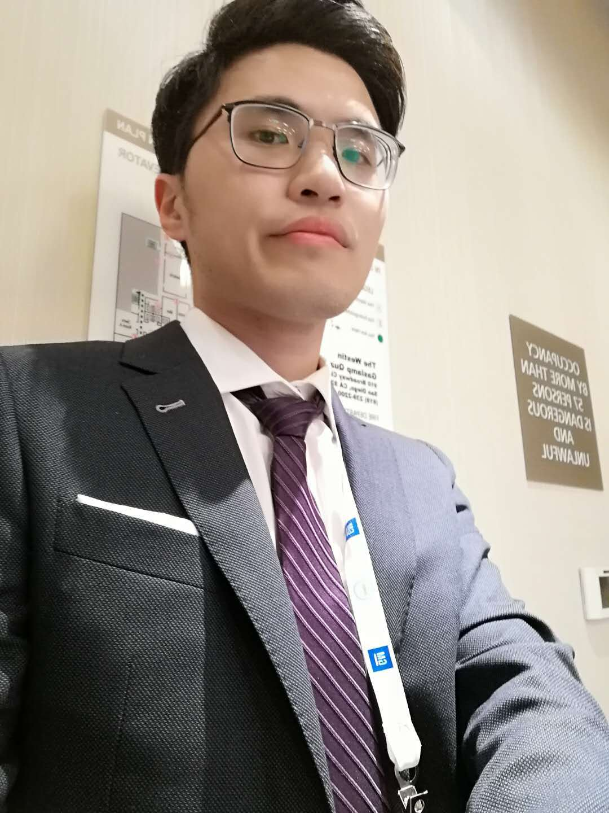
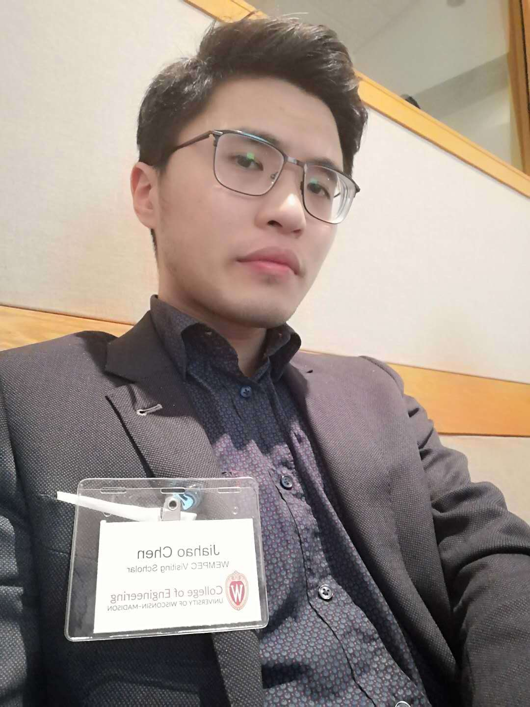

* TOC
{:toc}

十年书生落选，少年状元得意——健康地探讨人生的意义，不过成长二字罢了。

​                                                              2019年5月14凌晨

​                                                               于圣地亚哥

## 第一天-麦迪逊-11号

2019年5月11日早上七点半，在工学院门口等Nick来接我，他女朋友Abby送我们去麦迪逊机场。这几天是本科生毕业的日子，但是毕竟是周六早上，当然没什么人啦。Abby的车具有浓厚的艺术漆息，就好像是找了一面墙把车漆到处都剐蹭了一遍，让你看不出这是不小心剐蹭出来的痕迹——显然这是家中的老车，值得一提的是，这车门是无边框的，其他的部分大概是我高中时期见过的温州出租车差不多吧，而且应该是一辆注重操控的车，路感清晰，坐在后排感觉我在用我的屁股在跑步一般，经过美国破烂的水泥路面，车子的悬挂还不知道轮子会左右移动，有一种转向失控的错觉，甚至是后轮辅助转向的错觉。行进过程中，Abby摘下了墨迹，她有一双美丽而忧郁的眼睛，Nick眼光不错哦。

八点到达机场，我一抬头，他们竟然亲在一起了！Damn，这招我要学的。

九点半起飞，我们好像坐了空中的士，只飞了25分钟就到芝加哥机场了。

吃饭的时候我问Nick，你们俩咋认识的。他说她跟他在一个工厂实习，她在播放音乐，他走过去：I like this song，于是开始了一段爱情故事。他反问我，我说我们是在学雅思的时候认识的，她就坐我旁边。Nick问，雅思是什么东西？我想了想，对头，我也不知道测试中文的考试叫啥。期间我还给他介绍了社会主义好，我们学费少，我们公路平。他问我，那你们工资多少？我说比较好的学生大概年薪14000美金吧，考虑到我跟他说的房价，他被震惊了。我问他你硕士毕业后准备干啥，他说房地产。于是我给他介绍了中国式投资的诀窍，就是我们温州人带的头，还说就你出生的城市的人口，那就是中国大山里面的一个村庄罢了。

## 第一天-天上

去圣地亚哥的飞机上，他给我推荐了 jupyterlab 加 SymPy，相当于加强版的 jupyter notebook，因为我说 jupyter notebook并不实用，SymPy我倒是用来求过高阶矩阵特征根和一些变态传递函数。于是他问，那你咋推公式，我说 mathtype 加自定义快捷键，他说，那是啥？

厉害的是，飞机经过了ROCKY MOUNTAIN（就是此文封面的照片！）。我还给他推荐了华为手机，我说我左手这台华为300刀（我老婆给我的，在美国只能2G），右手这台三星s7 edge八百刀（我爸给我的，没错，我就是家里回收旧手机的那个人），但是华为各方面全胜。他问：我能买到华为吗，我的三星s6太老了，我说欧洲可以，美国不行。

## **第一天-圣地亚哥**

从四个小时的飞机下来后，我们去海边逛了一圈。我本来说我要去搏击海浪，但那海水冻得我脚疼，还是算了。然后，我发现爬海边的礁石比看起来有趣多了，有一瞬间感觉回到了爬滑梯的孩提时代。

我们晚上误入了一家高级牛排馆叫Rob's pub & restaurant，Nick说：we are under-dressed。时差2小时，我太饿了，我点了一个16oz的牛排，43刀，加上15%小费50刀。

## 第二天-圣地亚哥-IEMDC 2019-12号

听不知道谁说的，iemdc是唯一一个ieee四个协会（ies，ias，pes，还有个电力系统的s吗？）一起举办的国际会议。专门讨论电机的会有有三个吧，欧洲比较多ICEM，环太平洋搞ICEMS，美国搞IEMDC。其他会议如ECCE也包括电机，奇数年份的时候（举办IEMDC），此时ECCE中电机的文章会减少很多——这是常乐跟我说的。

今天一天就是参加八个tutorial中的两个，其中来自 UK 的 MotorCAD 伪装成 tutorial（即整个摘要里面没有提到 MotorCAD），我被骗到了，去听了一会，发现事情不太对，赶紧跑。

我去看了一眼那个 G. P. (Gianmario Pellegrino) 和 Bojoi 的 tutorial，教电机控制，是我都知道的东西了。

绝望的我，走向第三个 tutorial，是由来自肯塔基大学的 Jiangbiao He 和年长于他的同事 Behrooz Mirafzal 作的电力电子故障诊断和容错控制的 tutorial。相信我，其内容绝对比名字听起来有趣多了，值得我花费4个小时听，但是总共也没多少人来听，十个人以内吧。大概简单介绍一下我注意到的几点要点（请和文末代航的内容进行比较阅读）。

1. He提出了一种NDPWM（New Discontinuous PWM），改善IGBT的节点温度水平，提高IGBT使用寿命达6倍～ 的通病，怕母线 shoot-through（直通）。当然我们会加入死区，但是问题是，开关元件的门极处有寄生电容，可能产生导通信号，误导通，造成短路。为此，可以在硬件层面上（加一些模拟元件）进行检测和预防。
2. 碳化硅（SiC）等宽带隙？（wide bandgap）元件的出现（见图6），导致了 VSI （电压源型逆变器）中 dv/dt 问题的加剧，因为 SiC 支持更高的开关频率。He 讨论了几种减轻dv/dt的方案，但是他展现出来的感觉还是：设计逆变器输出端口处的 RLC 滤波器是比较方便可行的方案。
3. 三相半桥逆变器，如果坏了一个开关管，就缺了一相。
4. He 比较推崇的是一种含有 Extra Leg 的NPC（Clamping，母线中点嵌位？）逆变器拓扑（见图1）——就是在普通三相NPC逆变器中，在开关管前面，母线电容后面，加一个桥臂。这么做有三个好处。第一，clamping意味着三电平，有助于降低 THD（Total Harmonic Distortion）。第二，逆变器具有容错能力，任意一个开关管断开后，三电平变二电平，但是仍然是对称激励。第三，extra leg 用SiC元件，其他开关管用普通硅元件，可以把所有开关损耗都引到该 SiC 元件上，这样普通硅元件都是零电压、零电流开断，降低开关损耗。
5. Extra Leg 必然会导致系统效率下降（零点几个百分点），这一点我不是很理解，虽然我问了，他答了，还是不懂，只能认为是三电平运行的时候，零电平的导通损耗加大了，所以增大了。我猜想故意二电平运行的话，也就用不到 Extra leg，那么效率是不会下降的，是我没问清楚。
6. 有意思的是，仅仅是三电平，也有人觉得多了。He 举了一个NPC作为产品的例子，Yaskawa 最新的 G7。
7. 还有一种容错逆变器的做法，就是CHB（Cascaded Half-Bridge，图2），这个思路和 NPC Inverter with extra leg 不太一样，后者是保证三相对称，而前者是接受三相不对称的试试，去求解产生三相对称电压激励的解（图3），这是因为级联提供了更多的自由度吧。
8. dv/dt的影响分两种，一种是差模dv/dt（用RLC滤波改善），另一种是共模dv/dt。PWM激励下，母线中点和Wye解绕组中性点之间的电压不为零（此时，中性电流流不通）。一般轴电压是共模电压的十分之一。轴电流的存在会造成轴承疲劳，甚至损坏。为了对应共模电流问题，可以加 Shaft grounding ring，意思就是提供一个通路，不要去祸害轴承了。当然，磁轴承是一种彻底的解决方案。后面会提到，Prof. Giri V. 提出了一种 Multi-stage 拓扑，是不会有共模电压的，Giri 说完补了一句玩笑，大意是 Sorry Eric, magnetic bearing is not needed. 但是，Giri 说的多级变换器，可能只适合高压场合，低压场合人家连三电平都觉得多，其中，plenary speech中提到的压缩机（compressor）就是用的就是二电平。
9. 关于长电缆的问题，由于分布电容的存在，电流的流动就仿佛水流在流动，但是在流到目的地之前，要先把地上的坑给填上。这样的结果存在电机端过电压问题（可以达到母线的两倍），导致绝缘击穿或长此以往降低绝缘寿命（代航也提到了这一点）。这是可以建模的，见图5。好像高频模型中，电机绕组竟然变成了电容，当然，只有电机绕组中的前几匝是这样建模的。

图1：NPC inverter with extra leg

图2：Cascaded Half Bridge

图3：CHB 容错控制

图4：长导线问题

图5：高频模型（Mirafzal说这个很准，有物理意义，不是神经网络黑盒子建模的忽悠模型）

图6：几种材料不同的开关元件比较

Tutorial中途有一次coffee break，和He瞎聊的时候，杨笑风博士走了进来，一上来就交换名片，说下午有个当地汽车人会议。我跟杨交换了微信，然后他给我拉到一个500人的群里去了。。。

Tutorial 结束以后，和 Dr. jiangbiao He 聊上了几句，他评论道：现在公司分离设计驱动和电机，合在一起不一定好用。

下午的无轴承电机的tutorial，五个机构联合办，听起来很酷，其实效果不咋的。Wolfgang Gruber 说为了减少超高速时的转子振动，可以把位移传感器中的同步速分量给notch filter掉，放任转子绕着重心转（而不是几何中心转）。

晚上我们（吴昊和Nick）骑着 lime 的 Scooter 就出发了，有点贵每分钟0.15刀，Nick说这很便宜啊，我跟他说一刀就能骑骑电三小时，他被震惊了。吃饭的时候，隔壁的酒吧开始唱歌，大家伴着鼓点在舞池跳舞，我说，这是非洲音乐吗？Nick笑着答，我觉得是墨西哥音乐。我说，Si，两年前的iemdc就是这样的，不仅刚来就有晚餐吃，还有一串舞娘一起嗨皮，他表示羡慕。

晚上回去的时候，到了一个小广场，我说我给你们俩拍个骑scooter的视频，拍着拍着，Nick去阻止一个准备拿走我停在一旁的schooter的黑人，绑着脏辫，嘴角莫名白色，我一开始以为是想借车的人，但很明显不太可能，车灯是亮着的说明在使用中，他一直在说着什么，我大概听明白了，意思需要帮助，Nick看这家伙不好对付，给了他一美金，结果他继续说话，大意是不太够。如果是在中国出现这种情况我是一点都不慌的，但是，相信我，黑夜里的黑人真的看起来很危险。当然，我们没有继续给他钱，拿过schooter我们就骑走了。

## 第三天-圣地亚哥-13号

早上，七点多起来先注册，Nick先完事去买早餐去了。然后我偶遇了山东大学的张祯滨老师。

8点在一个ballroom集合，我不敢相信安排了长达40分钟的opening session竟然就是让大家干坐20分钟，讲10分钟，然后提前开始Plenary speech。

第一个 Plenary speech 讲了一个高速兆瓦级的压缩机应用，当然，是有磁轴承的，用的是二电平功率变换器。Jiangbiao 问为什么商业产品中用AMB（Active Magnetic Bearing）的见得不多，原因可能是什么？答：只要成本一样，就可以上AMB。

结束以后，我就赶紧去黄立人师兄啦，发现他需要帮卢老师代讲ppt。他说卢老师一行在海关排队排了四个小时。所以，中国过来飞到哪里都行，就是不要轻易飞西海岸的大机场（开玩笑）。

10点半口头报告开始。

第一波做oral的人可以吹了：我当年去iemdc做报告，门庭若市，熙熙攘攘，摩拳擦掌，人多到连站都站不下，只得在门外听——呃，今年的iemdc举办方能准备再小一点的房间吗？要不要试试下次在日本的胶囊旅馆里开会？

东京工业大学的Noguchi做了不同极槽配合的 Consequent pole 的无轴承多极对数电机，结论就是选择绕组函数差的24槽20极方案，对悬浮控制有益（因为不像22极方案有xx次谐波对悬浮力控制产生巨大扰动）。

这里有点可惜，我错过了Bianca的演讲，因为是做slice bearingless motor的，我就跑去听老诸的学生讲分数槽电机了。

意大利人的英语是全世界最糟糕的了吧。一个来自意大利的学生提出了一种element除去优化法（就是把转子剖分一下，消掉不需要的d轴上的element来获得转矩，但是又要留一些下来保证机械强度），来选定“小肋骨”的位置以提高同步磁阻电机的结构强度，这是我印象比较深的一个口头报告了。虽然那个element消去剩下最优设计的小肋骨的动画很酷，但我感觉没啥意义，高速场合我为啥要用同步磁阻呢。

中午吃饭的时候，卢老师跟我说，现在青千不仅仅是36个月海外工作经历和文章哩，而是要有亮眼的项目或课题，或者至少选择对的研究方向。这一语点醒了我，好像一年两年前有人是这么跟我说过了的。一些博士生（我）对于一些难以达到的要求，会选择去无视它，忽视它，忘记它。这一点，既对又错。黄立人师兄过来给我介绍了一下知乎面基对象一号：杨雷。后来poster的时候还遇到杨雷一次，但是（高优先级的）黄在旁边，没太多机会了解杨的高端无刷高速电机技术。

吃完以后，我看到了Eric和Nick在聊天。后来，Eric给我们介绍了一个好像叫George的人，他说感应电机很难控制，Nick表示同意，我说，That is the fun part.

今天下午我最后一个口头报告，感觉听别人讲都听得不认真了我。

在我的oral session开始前，我又上楼练习了一遍，临时还加了点东西。我提前到了会场，和chair Emil K. 闲聊了几句，他可能是芬兰人，好像和狄冲有点关系，但是我不太听得懂他在说什么，时而尴尬。然后时间还有多，我就逮着那个经常出现在 Chiba 身边的年轻男子聊天，没想到他就是 Sugimoto（杉本），看上去是很年轻了，我还用日语自我介绍了：kagotomoushimasu，doumoyorosshiguonegaishimasu（カゴーと申します、どうもよろしくお願いいたします），他笑得很开心，他笑起来时眼睛仿佛月弯弯，是个迷人的仔。我跟他说我两年前遇到了 Tsunoda（津野田），他反应不过来，我说Shinshi（進士）的学生，他才想起来了。他说他看过我的摘要，说他们仿真感应电机的时候要等很久，我说我这就是在解决这个问题。

在我讲之前，佐治亚理工的宫成博士在做超高速，多物理场仿真超溜。他的导师说话总有一种要跟人干架的感觉，虽然说得都是对的。后来第三天的poster我遇到宫成，他说你是不是二次元的，我表示震惊和害怕，他说他注意到我说chiba sensei了。可怕的男人。他说有空多引我文章啊，我说申请绿卡需要引用数吧，他说是。

正式做口头报告的时候，那和练习的时候的感觉完全不一样。练习的时候，我可以有类似第二个人格在暗中观察自己。实际开干的时候，有点信息太多处理不过来。我很担心我某些单词上说错了，但是我却根本想不起来我说过了的单词是哪一个，太可怕了。再加上Eric在下面盯着我看，时而诡异不露齿地笑，我就感觉我快不行了。事后，Eric过来跟我握手，说你做得很棒。他是美国人，应该说的就是他想的——主要还是我完全想不起来我说得怎么样，脑子空白了。但是我记得的是，坐得离我最近的Chiba中间快睡着了，而且我还两次提到他的名字了，第一次是 Prof. Akira Chiba，第二次是 Chiba sensei（千葉先生）。

完事以后，还有一个陌生人老外说我讲得不错，然后笑着走了，我分不清楚那是给Eric面子还是真的，也可能只有中国人（我）才会多想这么一步吧，其实虚心接受就是了。然后，很令人开心的是，Chiba 竟然主动来找我搭话了，说他们也在做汽车用感应电机（有轴承的），他问我用什么有限元软件，我说JMAG，他说，Oh~JMAG，还说他很惊讶他的学生说电压源激励比电流源激励算起来要快，我说，我也惊了。

结束以后，Nick也来说，Your practice paid off, you have improved a lot since your first presentation. 我表示谦虚，他退一步继续夸。美国人很会夸人，我很想学习一下这个技巧，不是那种奉承的夸人，给人一种打从心底的真心的感觉。中国人（我）好像会计较很多细枝末节的东西，导致自己说不出这样的话。其实这是一个很重要的能力，如果你能找到别人的研究工作中的闪光点来夸，那就能找到他的工作的意义，然后考虑他这么做的代价是什么，最终形成你对别人的工作的一个理解：值还是不值。

然后，我遇到了知乎面基对象二号：张哲，进一步证实了咱们这个圈子很小的事实。张哲说Jiangbiao是因为GE（通用电气）的 Global Research 不太行了，所以才离开的。跟他聊 EMI 消除了我很多疑虑，有一种拨开云雾见月明的感觉。他说的工业界和学术界脱轨的例子发人深省（为EMI建模不被业界接受）。当时，我内心的想法是如果我能当上老师，那之后我会努力往这个方向努力的——但是，为什么要等？为什么不是现在？这种想法不过是没啥能力的人的借口罢了，是改变不了现状的悲惨的自己的最后的一块遮羞布。

晚上，我和Nick出门，在电梯里，遇到了Dr. Guangjin Li，一接触就能感觉到是一个很Nice的人，而且能在老诸那里留下来当老师，很强。我们仨在电梯口唠了一会嗑。

然后我们俩继续往外走，看到Chiba和一群人围成一圈在大厅里聊天。后来看到Eric出现，我们就加入了他们。Eric给我和Nick介绍了Bianca，她是来自奥地利的硕士生。Bianca瘦瘦高高，是个美人胚子，然后我就发现我不太会跟女生说话了（其实并不是这样的，实际上面对越漂亮的人你就越应该无视对方，总结起来就两个字：冷漠），Nick倒是跟她聊得很自如，展现了超强的社交技巧，我会对Abby保密的。

我们晚上就在酒店外面就近的一个Pub吃饭。需要两张长桌子才能坐下16个人。Bianca坐在我对面，我左边是Noguchi（野口），右边是Nick，Bianca的右边坐了一位光头帅哥，我一眼就看出来他对 Bianca 有意思。我的社交原则很简单，已经说过了，当然不会跟bianca聊天，即便她正对着我，仍然是Nick跟她交流，但我发现她意外地喜欢聊科研话题，神奇的女人。我呢，则开始攻略我旁边的Noguchi，一开始先用英文跟他搭话，发现他是硕士二年级。后来我就说我叫Kagou（嘉豪，你要是读成卡狗的话，我只能表示呵呵），还用日语介绍了我两年前在这个会议上遇到t津野田的事情：二年前、この会議で、津野田さんと出会てました。津野田は千葉と進士の学生です。后来我问他彼女できましたか。他说没有。我还说我看アニメ哦，他说他也看哦，我拿出哔哩哔哩App给他看，结果他竟然都没看过盾，或辉夜，呵呵。

当然，一直和身边的人聊天也不太礼貌，我终于还是和光头帅哥对上了眼，他自我介绍说他是bianca的男朋友。我说，你眼光很好，女工程师不多哦，不觉得她这样很性感（hot）吗。他说，啥？我说，Sexy。他说，你是对bianca有意思吗，说着就拉bianca的手臂，意思要给我牵线。我赶紧打住他说，我已经结婚了，给他看了看我的左手无名指上的婚戒，他露出了神秘的笑容，我继续说，其实我是一个父亲，我儿子都三个月了，我问你要看照片吗，还给他们看了我的华为手机的桌面背景。

晚饭期间我感觉我拿出了我至今为止最强的聊天能力，我拿着啤酒酒杯，问，人们在奥地利怎么喝酒，然后就打开了大家的话匣子，他们说了一些疯狂的游戏，我说能不能现实一点，咱们数7吧，光头帅哥看了看Bianca的眼睛说：I cannot get wasted today。Noguchi说准备读博士。有意思的是，光头帅哥（好像叫Floria）说他们那边（奥地利）公司用人不喜欢用博士，因为不想付博士的工资，他是硕士出来做测距雷达的。Nick说美国人除了工程师都适应英制单位，有一次火星降落失败，因为两个公司一个用mm一个用in。  期间，我上完厕所回来，听他们在说 gender word in language，比如女生可以用 guys；在德语中每次都要强调男或女，甚至有人会在演讲前声明我接下来提到男性的时候也包括女性；我拿出了二外是德语的夏青青教我的绝招说：Is this true that table has a gender in German? Floria说桌子是男的，啥啥啥是女的，玻璃杯是婴儿，Nick说，还有婴儿？Floria说婴儿意思是还不确定性别。聊到签证，Floria说欧盟内部随便去。我说英国呢？Floria说英国是特别的。我说英国脱欧了吧？Floria很严谨，说，是吗，是最近两周的事情吧，两周前还没有。我赶紧说，应该是我错了。我说，我去香港和台湾是需要新的“护照”的，他们表示震惊，然后他们很好奇香港和大陆车辆交流的时候左右车道是怎么变道的，后来猜想是弄个桥，我说香港和大陆是有border的，他们震惊二次方。我们聊到晚上9点吧，拍了个合影。

回到酒店后，我的白衬衫需要洗衣粉，柜台说没有，让我去买，给了我张地图。走在圣地亚哥市区的街头，有很多homeless，还有一个黑人小哥就站在街头看着你，经过他真的不知道他会不会开始跟上来。我是真的很庆幸生活在中国，*在一定程度上，我是xxx主义的，我一开始其实并没有意识到，这一点还是王博士给我指出来的。只不过只有最强的一方才有评价规则的合理权力。*

## 第四天-14号

早上的Plenary Speech我就没去，讲的也是磁轴承+压缩机。

坐在电动小车车上的Lipo的选择还是去听多相的oral，一共也就三篇，还有一篇是电子变极的好像，呵呵。

Poster比oral有趣多了，因为可以聊天。

我一直说这次会议办得很烂，具体哪里烂又一下子又说不出来。喝咖啡的时候，张祯滨老师一语点出，banquet应该放在第一天，没有reception dinner，没有早餐。当然还有作报告的房间太小。

喝咖啡的时候碰到了Ohio的张智伟，和张智伟喝咖啡的时候遇到了卢老师，他们两个都喝水。张做了一个混动汽车中免去行星齿轮的双机械端口的工作，两个转子之间有能量传递。今天确实看到好几个双机械端口的工作，还有一个来自加州大学伯克利分校的好像也是，不懂，就没搭讪。

遇到了赵硕丰，这名字看着眼熟，他说他也是浙大的，现在在圣地亚哥工作（大概吧，可能和谁记混了），被拉过来帮人站岗。我估计那人是签证问题来不了了吧。

来自奥地利的Gerald作了一个双转子双定子的磁齿轮，需要用到两个高速轴承，两个低速轴承。Nick跟他聊得很起劲，我也去看了一会，还给poster拍了张照片。

我和 Ohio 的 Julius Woo（好像是徐龙亚的学生？）是在听一个日本小哥讲single drive bearingless motor的时候碰到的。这个日本小哥很认真，拿了个教棒，末端还是橡胶的。我问他你花了多少买的？他说，是实验室里拿的。他说不出Laboratory这个单词，我直接说genkyuushitsu（研究室）——跟小明的词语接龙在这里派上了用场——他就笑了，Woo在一旁我没看他当时的表情。后来跟Woo单聊的时候，他准确地念出了我的名字，给了我一种错觉，下意识地说出了：Do you know me? 他说，No, you are not that famous yet. 我尴尬地笑笑。我遇到的几个韩国人都是比较自信的，也不惧于说英语，这点很 impress me（直译：给我很深的印象，翻译过来感觉意思差强人意）。Woo 在做表贴式永磁高速电机（当然要加sleeve），他不是很理解为什么今年开会有这么多关系磁悬浮的东西，他觉得在30000转每分以下，接触轴承就很够了。我说，对的，如果是在汽车里用，磁轴承的径向力stiffness是太低了，但是在一些压缩机应用场合，尤其是需要密封转子的时候，磁悬浮是很好用的。传统解决方案是用压力密封（参考youtube视频：https://www.youtube.com/watch?v=Vhc-hEjh12I）。我问，你的轴承哪里生产的，他说德国，我说对吧，他说一个就要1000美元。后来，我去问云磊，他说，我们的涡流位移传感器一个2000美元（一对起用）。

我还跟卢琴芬老师扯皮了，她帮祝老师的一个学生作展示，分析磁悬浮系统的振动的，她说你这个无轴承电机用的少，现在还是磁轴承多。我说，那才是机会啊。她说，是机会也是挑战。卢老师说诺丁汉有人做磁轴承。确实，有个诺丁汉的口头报告讲了一个只用两个惠斯登全桥（whitestone bridge）的桥式结构，这样反电势都抵消了，可以快速调节磁场能量，想施加在哪里就哪里。这种配置，可以把四个全桥逆变器降为两个全桥，但是开关管还是比Nick作的三极磁轴承要多。

*好多人都没来成美国，黄晓艳老师虽然拿到了十年签证，也因为一些（网络堵塞？）原因登机失败了（好像）。我希望有一天能不要再在美国开会了，听过太多人都因为签证来不及等原因来不了。知道这种事实的组委会，也没有选择提前发送邀请信，别人注册了会议、缴了钱，才发邀请信，明明知道现在政策下的美国大使馆难搞。如果说组委会不知道（因为每年都会换），每年都有缴了钱却来不了的中国学者，不应该询问一下原因吗。你以为你是老子吗，无为而治啊？很多时候不作为也是罪，本质上就是能力配不上工作的人。*（感觉这段话打得逻辑有点奇怪，就不重新编辑了，本来就是有点生气打的字，大意就是想表达一种不知道找谁撒气的不舒服的情绪。）

我给大家看几个磁轴承 gas compressor 的方案，看完以后谁还会觉得无轴承电机不是更吸引人的方案呢？

图7：磁轴承压缩机方案

吃午饭的时候，我和Nick遇到了黄立人师兄，我们仨一起愉快地吃了饭。我问黄立人，英国脱欧了吗？他说一直在吵，还没有正式地。我把我的名牌给了师兄，这样他就能代替我去航空母舰上吃晚饭（banquet）了，然后他的老婆就能代替他去吃了。

12点半，我们整理完东西出发去机场。去机场的路上，狄冲（知乎面基对象三号，Pyrhonen实验室的）跟我说看在灵感来自你的iemdc文章的份上，写文章带带你。我说好啊好啊，等我回去视频讨论啊。他说初步结果是实心转子高速感应电机的瞬态场求解时间36个小时降为12个小时。（我iemdc弄的无轴承感应电机的瞬态场则是20小时降为一分钟。当然，实心转子的剖分情况是不一样的。）

在机场，Eric跟我说，他很惊讶这次的会议几乎就是无轴承电机专场，连plenary speech也都在用磁轴承（这一点说明卢老师的认识还是很正确的哈哈），他说无轴承磁悬浮的文章就有40篇，其他电机的一共80篇。

到麦迪逊已经22点多。Nick的女朋友来接我们，我们和Eric道了别。Abby问：where are we going。我说，You guys can dump me at school。Abby笑了。我内心为我自己能用英语幽默幽默感到哦一丢丢开心。Nick说，No, we will send you home. 我说，That's fine, there is still bus, I have checked. The night is still young for me. You need to get some sleep soon.（此时Abby 又笑了，我不知道她在想什么） Big day tomorrow, and I don't even need to show up. Nick说，I am jealous. 

我在等公交的时候，背了Anki上这几天欠的日语单词。微信上，许扬说：welcome home。

## 第五天-麦迪逊-WEMPEC Annual Meeting

早上8点，Eric 的演讲一如既往逻辑清晰。优秀的Nick，我觉得优秀到能得IEMDC最佳Paper他听了赶紧说我过誉了的Nick，才一年级就已经能在200人面前作报告了，啧啧。

然后是Giri。Giri：Clamping的好处之一是避免死区失败的直通。

最后是Jahns（老姜），他提到了铁耗模型高频激励下不准（常乐在做），转子上散热困难（一个学生在做，热虹吸，转子上有液体，我简单看了一下，方案和双水内冷应该是不同的）。开关短路故障的VSI加高速永磁，糟糕的组合，就算把健康的管子都关上，续流二极管照样会被永磁体反电势倒灌电流。他说CSI才好。没想到在这里还能听到黄老师最喜欢说的永磁高铁的问题（需要加装断路器，切断弱磁高速下桥臂故障的高反电势）。去尿尿回来他在讲PV（photovoltaic ）了。说到这个我想起了柯云飞（Phillip Krein，美国某院院士）来WEMPEC讲太阳能，结论竟然就是节省人力、节省安装成本，他好像是弄过一家做太阳能产品的公司。

听完Eric和Jahns的报告，我突然明白了一种计划研究内容的思路：想象自己将来要给一个总结报告，根据你要介绍的内容，系统性地安排科研任务。

Coffee break，跟刘明达和常乐闲聊：某不计成本的公司：2.2特斯拉的硅钢片，Laminated PM（减弱永磁体涡流损耗），轻松提升性能。

常乐：进入饱和的时候，iron loss会大升，但超过一定饱和程度以后，iron loss会大降。SiC元件开关频率的提高，有助于减少铁耗。

午饭的时候，云磊说看到我的微信列表的时候注意到了宫成的名字。我说，我感觉他的导师是个很难相处的人，云磊说宫成好像被他导师拖到了6年。我眼中的姜云磊是个很能干的人，几经辗转现在找到了属于他的道路，以后再说起他，应该是拿来提醒别人：试过以后明白了自己不想做的和想做的，那就去干（英文是 Smack it）。云磊说，Dan 拿到Tenure以后，可以休假一年。老美都是认真休假的，不回邮件，不接电话，可能会去搞搞创业的公司。云磊还说，无刷双馈也是双端口系统的一种，他评价道：低速的时候，双机械端口效率还行，高速就差了。然后说到周蕾，他们问周蕾是想来这边找教职吗，之前来这里交流作报告？我说，我也就两年前跟她有过一面之缘，不好意思问。云磊说，那她要是留下来，那不是跟Eric竞争了吗，这里可容不下两个搞磁悬浮的。说到这个话题，我又想起贱贱老师的谆谆教诲。但是反过来想，在磁悬浮这个小圈子里，大家倒是其乐融融，反而有点像个大家庭，各自心心相惜。然后我想起上次她来作报告的时候，当时别的我没太多印象，就是觉得周蕾还挺懂时尚的，知道近几年时尚圈流行的是绿色。

下午Poster。

云磊给我演示了 Eric 的无轴承单极电机的台子，我手摸上浮着的转子去抖得像一只猫或者兔子。

代航：提出SiC的CSI，续流二极管换成MOSFET，其中一个拓扑和Jiangbiao的extra leg相似。他说：就算是VSI加IMD（Integrated Motor Drive，指逆变器和电机装在一起，电缆短），对于高速电机来说dv/dt可能还是大，因为高速电机电感小，我表示赞同。他总结道：CSI担心母线电感过电压，VSI担心直通问题（当然还有EMI和dv/dt问题）。

一个叫Austin的学生，原来导师是老罗，做的还只是感应电机的磁链观测，创新点是不需要假设常值转速，我乍一看，妈耶，可以啊，追平我和Marino的研究思路了啊，我再仔细一看，怎么是频域模型，那是线性的啊，转速作状态肯定是非线性系统啊，我再仔细一看，呃，同步系电流模型，我脑内的神经网络大概花费了0.01秒我就想到了Tsuji2001早就提出来了，都过了十八年了你还在搞这个，再看，就是把状态空间模型改为传递函数，再离散化一下，让自己都看不出来自己的工作和别人的工作的相似之处，我说你转子磁场的位置哪里来的，他说现阶段还是假设已知的。我说你这个东西我知道（手指头一戳）这一步磁链误差反馈是稳定系统的关键，他有一点吃惊地表示赞同。此时许扬也过来了，正当我准备站在过来人的角度正式开始“打击”他的时候（意思是他这些做的太基础了，根本没研究过现有文献），Eric冲了过来把我拉走了，说要给我介绍两个本科生，让他们俩教教我怎么做人——怎么用激光切割机自己切硅钢片，教我怎么把硅钢片固定压在一起：可以用棒棒插进去然后用clip卡住（这就是刘文博的方案）或者是螺丝钉转进去，Eric说我喜欢后者。说到绕线，他说这些都是有绝缘的，红色的是可以不管绝缘层直接焊接的，我问有没有裸铜线，他们说没有，第三个本科生问我要干嘛，我说感应电机转子要用，他说感应电机很难控制啊，我说 That is the fun part.

最后，我和Nishanth还有Anvar聊了很久。我说Eric和Chiba他们坐在圣地亚哥餐厅外面被人吼了。Nishanth说他去德国的时候和别人在屋外聊天也被一个德国人吼了。后来聊到德国人长尊等级分明。这个话题当然还会说到日本人，还聊到Prof. Asama过来，他说可以说话，他的学生才敢说话。我说我在墨尔本也遇到过一个不咋的人，结论就是，发达城市人多，垃圾也多，麦迪逊就感觉很良好，Anvar说到了汽车每次都会停下来让人，Nishanth说威斯康辛法律规定路口停车的。Nishanth说有一次，有个德国人被他叫错名字，然后就不鸟他，因为J的发音其实是H，而且后来还不接受道歉，说德国人在叫别人之前都要查好发音的，如果问或者被问怎么叫都会不开心。Anvar开始数数，一、二、三、四、五，然后他说不出六了，我们感觉很神奇，他便解释，说他去过中国交流（15人中国人，15人巴基斯坦人），去过北京、苏州、上海，打太极、看长城、剪纸挂倒福，品茶，逛苏州园林，完事以后，团体再去巴基斯坦体验体验。Nishanth说，我去过台湾，但是没去过中国。我脱口而出：Woooh! Be cafeful about that. You may offend someone from mainland China. 他解释道，对啊，所有才说mainland。我说，No. Repeat after me. You have been to China. 他表示明白了。

最后的最后，我们去二楼拿sweets，我和新来到我们地下室的韩国小哥Sangwhee Lee相互自我介绍了一下。我们聊到名字，Nishanth说他在Github上经常看到horychen想着这是哪个？他说hory是你的英文名吗，我说小时候给自己取的nickname（其实就是看康熙来了，曹格来的那一集，他说他叫gary，我就改改发音，就有了）。然后我问FNU Nishanth，你的名字FNU是三个名字的首字母缩写吗？他说他只有一个名字是Nishanth，FNU的意思就是全名就一个单词的意思，他的护照上没有last name。他说他爸是有姓的，到他没了。我说，You lost your last name from your father. 他说：也不是啦，是因为在印度户籍注册的时候，姓氏没有被打进去，有打进去，打进去，进去，去。。。

## 结语

这几天，看到这么多人都在努力让电机这个“夕阳产业”重新获得生命力，我感到很开心。回到开头——就像两年前的我不会想到今天的我会写下这些文字，想不到会被Nick说我很social他很感谢我把他介绍给了那么多人——世事难料，命运挑挑拣拣，人生几何，切忌患得患失。

## 附录

如果你坚持看到了最后，我该怎么表示好呢？

那只能自爆表示敬意了！

iemdc作报告当天的我（领带没拉到底，实在是有点太热了）

WEMPEC年会的我（我妈要跟我视频，我只能自拍给她看看）