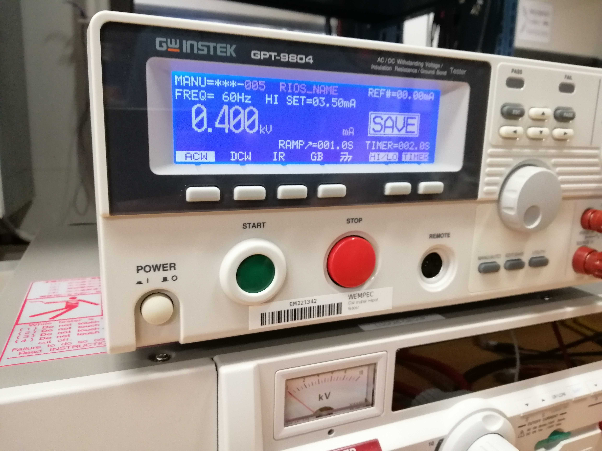
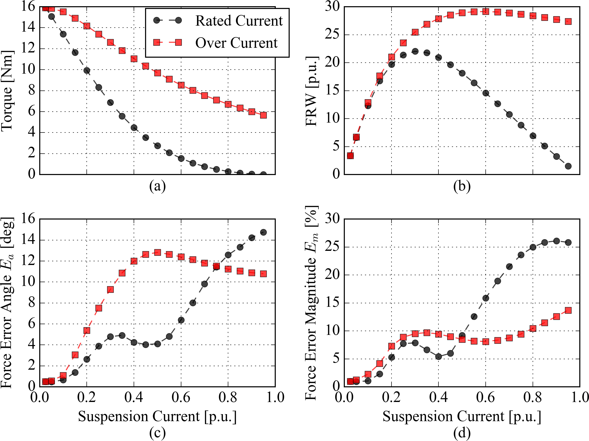

* TOC
{:toc}
> This report covers everything about building and testing the bearingless induction motor prototype. The first part is about the fabrication process and the second part is for the testing results.
>
> This is Part II: Testing.

# Testing

## Insulation Stripper

We have a insulation stripper that is very easy to use. The video file name is “Insulation stripper.mp4”.

After removing the insulation, solder the coils according to the winding diagrams and your defined strands in hand number.

## Resistance

### Rotor conductors

The measured resistance between copper bar and rotor core is 0.26 Ohm.

The measured resistance between two bars is 0.000083 Ohm.

Watch video for detail. File names are “Resistance between core and bar.mp4” and “Resistance between bars.mp4”.

### Stator winding

The resistance for 18 turns is: 0.36 Ohm.

The resistance for one coil (4 coils parallel soildered together) is: 0.09 Ohm.

The resistance for one phase winding (torque terminal) is: ? Ohm.

The resistance for one phase winding (suspension terminal) is: ? Ohm.

Note: must use “**4 Watt option**” of the resistance meter (see the video: “Resistance between core and bar.mp4” or “Resistance between bars.mp4”) to measure resistance.

## High potential/voltage (leakage current) test

The stator (with winding) passed the test for 400 Volts! See the picture below for detail.

## Spinning the motor for the first time

The voltage applied is 60% times 30 V. The frequency is 30 Hz. The AMDC firmware is used. The function “vsi“ is used. The video is “Spinning.mp4”. 

## Ratings

### Specifications

At the design stage, it is assumed that the voltage rating is 480 Vrms for this wye-connected 50 kW, 30,000 rpm motor. The parallel number of path/branch is 2 to enable a parallel no voltage combined stator winding setting [it requires more, e.g., on the number of slots $Q_s$ as multiple of 12 and the number of poles (cannot be 3)]. With a shear/tangential stress of 12 kPa, the rated stator current is 180.874 Arms. To achieve the rated power, the motor should be axially scaled to 281.2 mm.

The power stack (a nick name for inverter) we have is tested under 200 V dc bus voltage and 10 A ac or dc current. The Voltage rating for the switching device is 1200 V, which implies a highest output voltage somewhere below 600 V to make sure there is a safety factor of 2 for over-voltage (e.g., high dv/dt issue). 

Please note that anything we say about rating is line-to-line value and we are considering a wye-connected machine, **which means 480 Vrms is line-to-line voltage and $\frac{480}{\sqrt{3}}$ Vrms is the phase voltage.**

### Making Compromises/Adjustments

Considering all these, we are going to derive a design with (less than) 400 Vrms and 20 Arms from the theoretical design. Some compromises are made as follows.

- The maximal operating speed is reduced to 15,000 rpm. So the rated voltage is reduced to only half, i.e., 240 Vrms.
- The actual stack length for prototype is only 50 mm rather than 281.2 mm. Recall that the magnetic flux depends on the area of air gap surface, and back emf is proportional to magnetic flux, so the actual voltage rating is reduced to $240\times \frac{50}{281.2}=42.7$ Vrms.
- The current rating and voltage rating are interchangeable. In order to reduce the current rating by a factor of 9 (from 180 Arms to 20 Arms) , the voltage rating is multiplied by 9, equal to $42.7\times 9=384$ Vrms.

## **Test Plan (Aug. 2019)**

The test plan is in a separate Google document: https://drive.google.com/open?id=1l98eyhyWQZS3gnybIsL-Qvg4tvbUdhBJn5ESm47_YN4

## Test Results

### Winding Resistance

### Impedance Measurement

### No-load test (Experiment)

Have to make sure the rotor speed is fixed, or else you can even get a negative friction loss.

### Blocked-rotor test (Experiment)

The test stand consists of the prototype, the torque meter, and the load motor (a PM servo motor with a drive). The blocked-rotor is realized by specifying a zero speed command for the load motor.

## Results needed for IEMDC 2019 Paper: the Journal Version

- Torque capability as a 2 pole or a 4 pole motor.
- Force capability as a function of suspension current.
    - 
- Not able to show the benefit of using a pole-specific rotor because the rotor is not spinning at high speed.

