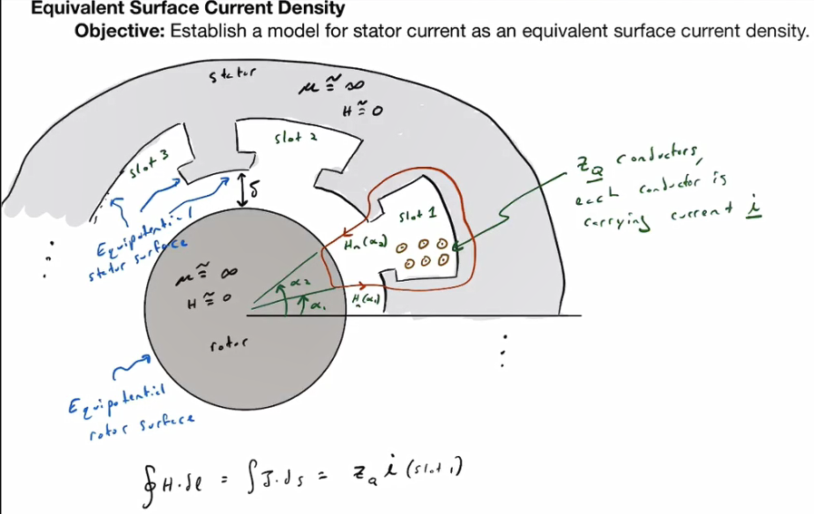
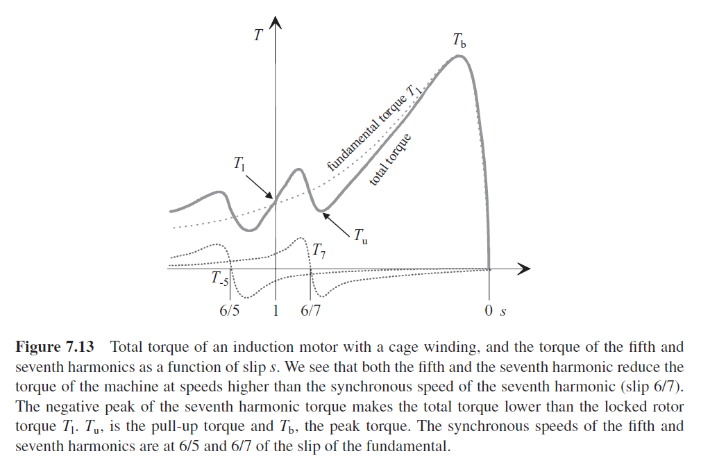
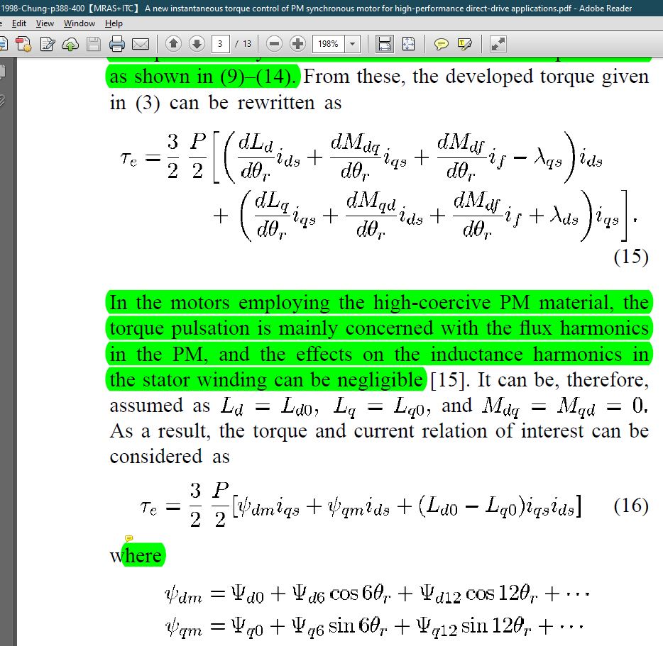

https://support.typora.io/Images/

1. **The idea of a surface current density.** Circumferential current density and linear current density: $A_c/r=A$, with $r$ the air gap radius.
   
1. 
   
2. Assume there is a **linear surface current density** on the inner bore of the stator: $A(\alpha) = \hat A \sin(n\alpha -\psi)$. The dimension of $A$ is $\rm A/m$. This is probably due to a winding (subscript $~_w$) trying to generate torque (the current in it is called torque current). $n$ is the number of pole pair or the order of the component in question. $\psi$ is the winding axis (i.e., the location of the $q$-axis).
    1. This linear surface current density can be due to a 3 phase winding.
        1. $A(\alpha)=A_u + A_v + A_w = \frac{\hat A_{\rm ph,n}}{i}i_u \sin(n\alpha) + \frac{\hat A_{\rm ph,n}}{i}i_v \sin(n\alpha-\frac{2\pi}{3}) + \frac{\hat A_{\rm ph,n}}{i}i_w \sin(n\alpha-\frac{4\pi}{3})$ 
        2. $A_u = \frac{\hat A_{\rm ph,n}}{i}i_u \sin(n\alpha)$ 
            1. with $\hat A_{\rm ph,n}/i$ the amplitude of the fundamental component $n$ from Fourier series considering the winding layout (winding function) and number of conductors $z_Q$,
            2. and $i$ the current flowing the coil (which is defined during Fourier series analysis).
        3. $A_v = \frac{\hat A_{\rm ph,n}}{i}i_v \sin(n\alpha-\frac{2\pi}{3})$ 
        4. $A_w = \frac{\hat A_{\rm ph,n}}{i}i_w \sin(n\alpha-\frac{4\pi}{3})$ 
        5. $i_u=\hat I \cos(\psi)$
        6. $i_v=\hat I \cos(\psi-\frac{2\pi}{3})$
        7. $i_w=\hat I \cos(\psi-\frac{4\pi}{3})$
        8. Here, $\psi$ is at our control. **We assume the above three phase currents are the torque-producing currents.** You may argue this is not an appropriate assumption for induction machine, because the magnetizing current is provided by both stator and rotor. Okay, let’s clarify this. Let’s first remove the squirrel cage rotor from the induction machine, the 3 phase balanced stator current excitation will give you an air gap field and zero torque—note that torque is produced by an air gap field vector and a current vector that is not aligned with the air gap field. With balanced 3 phase current excitation, this is impossible to generate torque. That’s why we need another electrical excitation from the rotor circuits. If there is a slip, the rotor current is induced and the rotor current plus stator current will build a air gap field vector that is not any more aligned with the stator current vector—this will generate torque. Observed from the rotor (not air gap) field oriented M-T frame, there is only stator leakage field at T-axis, meaning that this type of motor is almost free of “armature reaction”. Why there is no air gap field in the T-axis? **Because the field in the T-axis is cancelled by the rotor currents (i.e., T-axis rotor current).** Recall there is no M-axis rotor current in steady state.
        9. In most cases, you will see $\psi=\omega_\psi t +\psi_{\rm ini}$, with $\omega_\psi$ the synchronous angular speed.
        10. $A(\alpha) =A_n(\alpha) = 1.5 \frac{\hat A_{\rm ph,n}}{i} \hat I \sin(n\alpha -\psi)$. Here the subscript $n$ stands for the $n$-th harmonic.
        11. Finally, we have linear current density of $n$-th harmonic as $A(\alpha)=\hat A\sin(n\alpha-\psi)$ with $\hat A=1.5 \frac{ \hat A_{\rm ph,n} }{i} \hat I$. Here, $\frac{ \hat A_{\rm ph,n} }{i}$ means the turns of the winding—which is obtained from the Fourier series expansion of the winding’s winding function.
    
3. **Normal fields due to linear surface current density**. Using Ampere’s law with a path through both stator and rotor iron cores, we have
   
    1. the normal H-field as $H_{n,w}(\alpha)=\frac{r\hat A}{n\delta_e}\cos(n\alpha-\psi)$,
    2. the normal current linkage as $\Theta_{n,w}(\alpha)=\frac{r\hat A}{n}\cos(n\alpha-\psi)$,
    3. the normal flux density as $B_{n,w}(\alpha)=\mu_0\frac{r\hat A}{\delta_e n}\cos(n\alpha -\psi)$,
    4. $B_{n,w}$ is not desired: it does not contribute to torque while it contributes to armature reaction.
    
4. **Tangential fields due to linear surface current density**. Using Ampere’s law with a path through stator core and air gap, we have
   
    1. the tangential H-field $H_{\tan,w} (\alpha) = - A(\alpha)=\hat A \sin(n\alpha -\psi)$.
    2. the tangential flux density $B_{\tan,w} (\alpha) = -\mu_0 A(\alpha) = -\mu_0\hat A \sin(n\alpha -\psi)$.
    
5. **Normal fields** due to induction motor’s ~~rotor current plus~~ stator’s magnetizing current, pm motor’s magnets, wound rotor synchronous motor’s field winding, $B_{n,m}=\hat B_m \cos(p\alpha-\theta)$

    1. We’d better call this field the d-axis normal field, because $\theta$ indicates the d-axis location (at d-axis $B_{n,m}(\alpha)$ has its maximum), which means this normal field is essentially different from the normal field built by the torque current, $B_{n,w}$, because the normal field is aligned with winding axis $\psi$.
    2. In a broader sense, the d-axis normal field can somehow be manipulated by us.
    3. To do this, we inject the motor with another set of 3 phase currents, denoted by subscript $~_2$, whose winding axis is aligned with d-axis ($\psi_2=\theta$) and pole pair number is $n_2=p$. This gives:
        1. the normal flux density as $B_{n,w,2}(\alpha)=\mu_0\frac{r\hat A_2}{\delta_e p}\cos(p\alpha -\theta)$.
        2. and the tangential flux density $B_{\tan,w,2} (\alpha) = -\mu_0\hat A_2 \sin(p\alpha -\theta)$.
    4. The “2” normal field can be absorbed into $\hat B_m$, **while the “2” tangential field $B_{\tan,w,2} (\alpha)$ should be able to create torque with the $B_{n,w}(\alpha)$, right? (This is a hypothesis  which turns out to be wrong.）**

6. Total fields in the air gap:

    1. $B_{n}=B_{n,m}+B_{n,w}= \hat B_m \cos(p\alpha-\theta) + \mu_0\frac{r\hat A}{\delta_e n}\cos(n\alpha -\psi)$ where we can define peak winding flux density: $\hat B_w=\mu_0\frac{r\hat A}{\delta_e n}$
    2. $B_{\tan}=B_{\tan,w} = - \mu_0\hat A \sin(n\alpha -\psi) -\mu_0\hat A_2 \sin(p\alpha -\theta)$

7. Finally, Maxwell stress tensor

    1. $\sigma_n(\alpha)=\frac{1}{2\mu_0}(B_n^2-B_{\tan}^2)$
    2. $\sigma_{\tan}(\alpha)=\frac{1}{\mu_0}B_n B_{\tan}$

8. Torque:
    $$
    \begin{aligned}
    T =&rl\int_0^{2\pi}\sigma_{\tan}r{\rm d}\alpha \\
      =&-r^2l\int_0^{2\pi}[\hat A \sin(n\alpha -\psi)\hat B_m \cos(p\alpha-\theta) + \hat A \sin(n\alpha -\psi) \hat B_w\cos(n\alpha -\psi)] {\rm d}\alpha  \\
      & -r^2l\int_0^{2\pi}[\hat A_2 \sin(p\alpha - \theta)\hat B_m \cos(p\alpha-\theta) + \hat A_2 \sin(p\alpha - \theta) \hat B_w\cos(n\alpha -\psi)] {\rm d}\alpha \\
      =&-\tfrac{1}{2}r^2l\int_0^{2\pi}
      \left\{
      \hat A \hat B_m \left[ \sin( p\alpha+n\alpha -\psi - \theta) - \sin(p\alpha-n\alpha +\psi -\theta)\right] \\
      + \hat A \hat B_w \left[ \sin(2n\alpha - 2\psi) - \sin(0) \right] 
      \right\} {\rm d}\alpha \\
      & -\tfrac{1}{2}r^2l\int_0^{2\pi}
      \left\{
      \hat A_2 \hat B_m \left[ \sin( 2p\alpha -2\theta ) - \sin(0)\right] \\
      + \hat A_2 \hat B_w \left[ \sin(p\alpha + n\alpha -\theta -\psi) - \sin( p\alpha -n\alpha -\theta+\psi) \right] 
      \right\} {\rm d}\alpha 
    \end{aligned}
    $$
    Here, the first term in is due to interaction between $B_{n,m}$ field and $B_{\tan,w}$ filed, which produces torque if $p - n =0$; the second term is due to interaction between $B_{n,w}$ and $B_{\tan,w}$. If you take $B_{\tan,w}$ for current, (for which it is), this result is consistent with what we learn during motor control: the torque is due to current vector **not aligned** ($\psi-\theta\ne 0$) with magnetizing field (i.e., the cross product is not null).

    Finally, we have $T=2\pi r^2l \left[ \frac{\hat B_m\hat A}{2}\sin(\psi-\theta) - \frac{\hat B_w\hat A_2}{2}\sin(\psi-\theta) \right] = V_{\rm R} \left<\sigma_{\tan}\right> $. Here $\psi-\theta$ is the power angle seen in synchronous machine textbook. The second term in motor shear stress $\left<\sigma_{\tan}\right>=\frac{1}{2\pi}\int_0^{2\pi}\sigma_{\tan}(\alpha){\rm d}\alpha$ is called armature reaction, which means if you excite another 3 phase current with winding axis aligned with d-axis, you can boost your $\hat B_m$ value to have higher torque of a factor of $\mu_0\frac{r\hat A_2}{\delta_e p} \frac{\hat A}{2}\sin(\psi-\theta)$), but there would also be reduction in the shear stress, which is $-\mu_0\frac{r\hat A}{\delta_e n}\frac{\hat A_2}{2}\sin(\psi-\theta)$. They cancel?!?! This could be correct. Because if there is only stator excitations, you cannot get any torque.

9. Suspension force.
   
    1. 

The above conclusion from item 10 is actually only valid for PM motor, whose torque is calculated by $T = \psi_d i_q - \psi_q i_d$.

For induction machine, $\psi_q$ is always null, so if you increase/decrease $\psi_d$, the torque will change accordingly.

There will be no $B_{n,w}$ for induction machine because the induced $T$-axis rotor current will cancel the normal field at $T$-axis.

In addition, the asynchronous torque in induction motor is another story, because the stator harmonic field will generate rotor harmonic currents of the same order, i.e., 5 or 7... which means there will be harmonic components for flux density $B_{n,m}$.

Things left to do, 

1. re-visit the winding function generator,
2. analyze the windings using Fourier series and get $A_{\rm ph, n}/i$ for real. Here $~_n$ means n-th harmonic component.
3. armature effect and flux strengthening, why do they cancel each other?
4. How to derive 6-order torque ripple? See 1998-Chung

电机设计的三个阶段：

1. 学习电机设计理论，比如电机常数这些，知道了如何改参数调整电机的性能。
2. 设计电机实战，考虑到一些机械性能，得到一个符合设计目标的电机的“template”，可以进一步考虑优化。
3. 推导电机设计理论，进一步考虑电机的散热。

Seok-Hee Han 2010 Torque Ripple Reduction in Interior Permanent Magnet Synchronous Machines Using Stators With Odd Number of Slots Per Pole Pair

"C:\Users\horyc\Desktop\没见过的转矩公式用磁密沿着磁动势的积分求的，转矩脉动最小化【来自金文博 北航】.pdf"