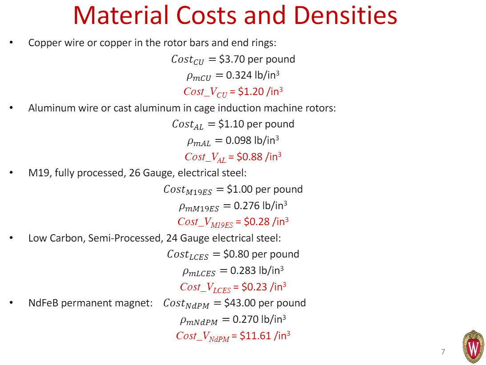

# ECCE 2019 BPMSM

The purpose: which topology is the best combination (Cost). What is the cause to force ripple?

Structural analysis can be optional: what about the sleeve length?

Cannot use FEMM because JMAG gives more reliable results on loss (core loss and magnet loss).

1. Draw the geometry

    - A VanGogh subclass that takes in parameters as pole, slot, segment numbers.
    - VanGogh_JMAG is a class that has utility to draw basic shapes in JMAG Designer.
    - VanGogh_BPMSM1
        - 

2. Decide the materials and their prices

    1. PM: N40H
    2. Steel: M-19
    3. Prices:

3. Configure the windings and excitation.

4. Do transient FEA in JMAG

    - Do structural FEA in JMAG (I think this is optional)
        - **Have you found any design that will explode?**
        - Even you have some designs that will fail. We are not optimize the mechanical strength.
        - Why not leave this as a post-process analysis.

5. 

     

    

**Make reasonable optimization problem definition. The problematic thing is the high dimension of the design space. I suggest we try our best to reduce the design space for the conference. I mean it does not hurt for me when I code for more geometry variables. But I has a strong feeling that a large design space means that the optimal design is not possible to be found.**

