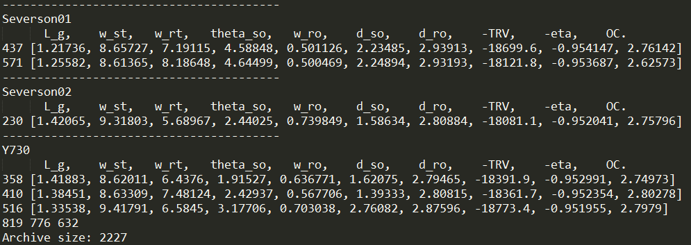
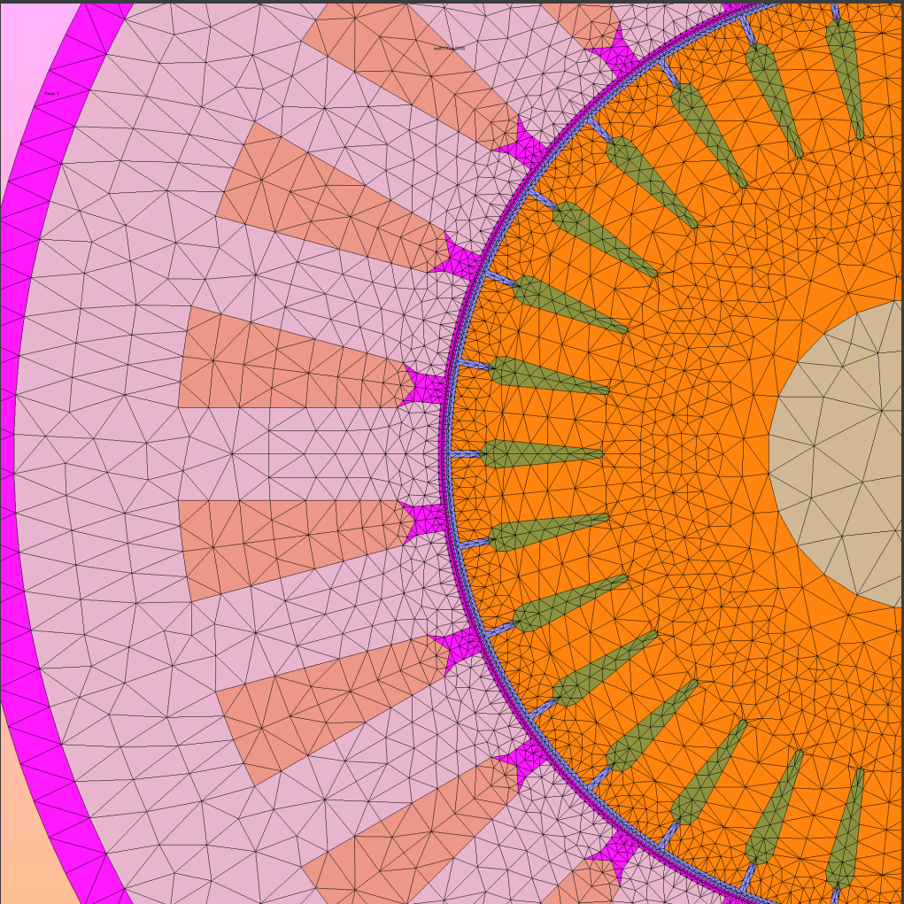
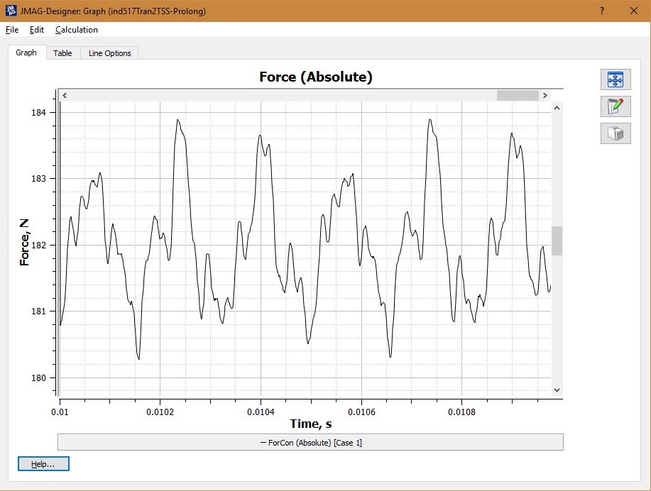
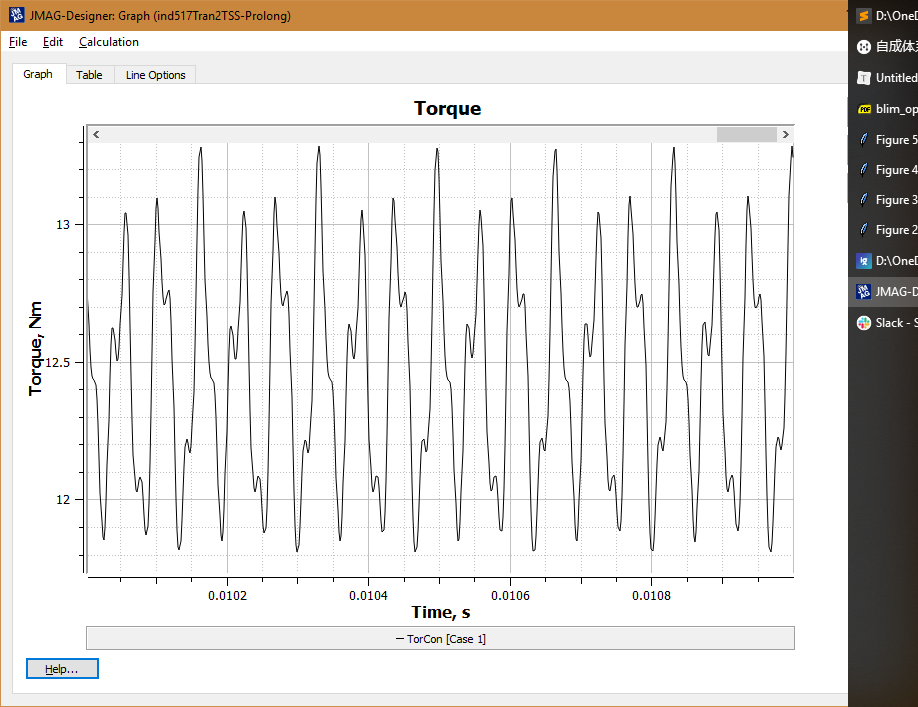

# ECCE 

2019 paper

- We need a block diagram to show the optimization and modeling process.
- Take a look at the introduction of the 2012 paper by Junich Asama & Chiba
- What a good bearingless IM design looks like?
    - How to pick good design?
        - TRV>18000, eta>0.95, $O_C$<3.
        - Here is the list of qualified designs among 2227 individuals
        - Take individual 516 (#517) for example.
            - 
            - Transient FEA results: 
                - Force
                - Torque 
            - Show the effect of the no back emf property of no voltage combined winding.
                - Set resistance and leakage inductance to null.
            - Show the maximum suspension force capability when no load torque is generated.
                - There must be an optimal ratio between the 2 pole magnetizing current and 4 pole magnetizing current such that generates the highest suspension force.
            - 

# ECCE 2019 Journal Version Plan

- Maybe leave some work for journal paper?
- Do 2 pole and 4 pole comparison.

Q: Literature status quo?

A: About optimization, the optimization work in the field of bearingless motors is still primitive meaning that the multi-objective optimization is not reported.

About motor type, for high power application, compared with PM motor, IM motor is not well received by the community. Why?

IM is difficult to model. Computational efficient method is desired. It is still taking too long for a **voltage source simulation**.

**What other people do? **

**Compare different optimization algorithm or play with the free variables (even not symmetrical geometry is allowed).**

# IEMDC 2019 Journal Version Plan

- Bearingless motor capability
    - Show the effect of the no back emf property of no voltage combined winding.
        - Set resistance and leakage inductance to null.
    - Show the maximum suspension force capability when no load torque is generated.
        - There must be an optimal ratio between the 2 pole magnetizing current and 4 pole magnetizing current such that generates the highest suspension force.

- Parameter study: its influence on performance
    - Local sensitivity analysis
    - A sweeping of stator slot opening 
        - Suspension performance: wider the better
        - Torque performance: narrower the better
    - A sweeping of the rotor slot number
        - For 4 pole motor
            - 16, 32
        - For 2 pole motor
            - 14, 16, 18, 30, 32, 34.
    - A sweeping of air gap length
    - A sweeping of short pitch
- **Stator skew. Will this generate axial disturbance force?**

