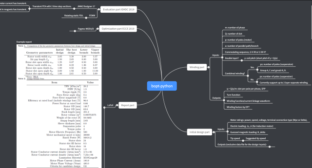

> 预计以此文对我这一年的电机设计经验做一个总结，缓慢更新预定。**应注意到我讲的是无轴承电机的设计，去掉悬浮力设计部分，就是常规电机的设计。**

## 第一部分：电机电磁设计的三个阶段

### 阶段一：理论学习阶段

在此阶段，我们接触到的是电机设计中的最重要的几个公式，在中文教材中叫电机常数——但是实际上它并不是一个常数——这个电机常数正比于电机的电负荷和磁负荷。我们也知道了要提高电机的功率密度，比起提升电负荷和磁负荷，还是直接提高转速比较方便。

### 阶段二：实操阶段

在此阶段，手痒的我们急着要一套设计流程，给定了电机的铭牌数据，按照流程一步一步地确定电机设计中的各个参数，最终拿到一台电机的几何参数，可以使用有限元软件进行分析，甚至可以用（真正的）多目标优化算法对电机的参数进行优化。

### 阶段三：掌握理论

理解阶段一的理论是怎么来的，能够从基本方程推导出电机设计的重要公式，相当于抓住了本质，这时我们想要的是能够比较不同的电机的能力，这里的不同的电机可能是具有不同的假设的电机，比如气隙不再是均匀的，存在偏置磁场等等——这些东西书上没有，要分析得自己推。

## 第二部分：电机设计的五个模块（代码，暂为 private repository）

'[1] Winding Part'  近期更新预定

'[2] Initial Design Part'暂时可以参考我已经有的视频

'[3] Evaluation Part'

'[4] Optimization Part'

'[5] Report Part'

> 查看思维导图：

bopt-pythonmubu.com

